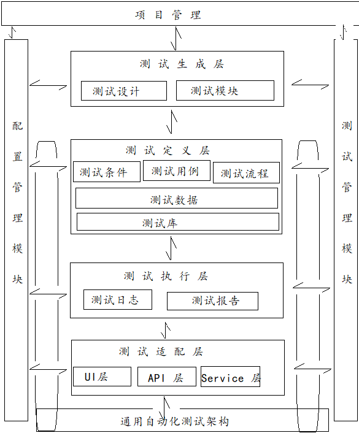

### 自动化测试框架概述
> **概述**
	> 自动化测试框架是用于组织、管理和执行自动化测试的一系列流程或工具的组合

>**自动化测试框架的演化**
	>在没有自动化测试框架之前，测试脚本是松耦合的，其编写规范和执行方式是由开发者自己决定的，即使在同一个项目中，不同的开发者也可能写出具备不同规范和执行方式的测试脚本，这显然是不可接受的，于是，我们便开始尝试统一标准，就有了各式各样的测试库，有些测试库用于测试用例的编写，只要在代码中调用这个测试库，就可以生成统一格式的测试用例。
	>在这个发展的过程中，涌现出一大堆各式各样功能的测试库，有的用于显示运行结果（Test Report），有的用于调度测试用例的执行（Test Runner），有的用于设置运行环境（Test Fixture），有的用于定义不同类型的测试（分别生成 API 和 UI 测试的抽象类），通过这种方式，开发者自主选择在代码中合适、如何调用测试库。
	>不同的测试库具备不同的功能，而且测试库中通常有很多方式，有的方法用来启动浏览器，有的方法在运行时截图，有的库针对同一个功能具备不同的实现方法，对于开发者来说，要想使用这些功能，必须针对每一个测试库及其提供的方法了如指掌，这样便带来了两个问题：
	>1) 同样的测试库未必能提供同样的功能，即使使用同样的测试库，不同的开发者写出的驱动测试执行代码的功能也不尽相同，这是因为何时调用、如何调用、调用后有没有做二次开发改变调用结果，这些都是由开发者决定的，更不要说是不同的测试库可以实现同样的功能了。
	>2. 学习成本过高，每一个开发者都得知道，在整个测试过程中自己的代码应该何时调用哪个测试库，调用时需要选择哪个测试库的那个方法，调用后需不需要做特殊的处理。
> 
> 为了解决以上的两个问题，测试库进一步演化，将测试脚本的编写到测试运行结束所需要的不同功能和作用的测试库组合到一起组成测试框架，这样一来，使用测试框架的人便不必再关心测试执行时，具体使用哪个测试库，哪个截图方法，由此可见测试框架保证了测试脚本编写标准、运行方式以及功能的一致性，同时，测试框架使用者可以从这些繁琐的技术细节中解放出来，只需关注测试的业务本身。

### 自动化测试框架的通用原理
根据测试类型和测试对象的不同，自动化测试框架可以衍生出不同的种类，按照测试类型划分，自动化测试框架可以划分为：性能测试框架、API 自动化测试框架、UI 自动化测试框架等；按照测试对象划分，可以分为： Web 端自动化测试框架、移动端自动化测试框架、客户端自动化测试框架等，不同类型的测试框架的实现原理虽然不同，但通用原理如下

从如上的框架
原理图可以看出，自动化测试框架包括如下的 4 个必备层
1. 测试适配层
   测试适配层通过第三方各种测试库与被测试系统交互，如：使用 selenium/webDriver 执行 UI层测试，使用 Requests 执行 API 测试
2. 测试执行层
	   用于执行测试用例的操作，收集执行日志并反馈测试执行结果
3. 测试定义层
	   用于指定测试用例的操作，包括指定测试用例的优先级、测试用例运行所需的数据、参数化测试用例以及定义测试的执行顺序等
4. 测试生成层
	   用于将手工生成的测试用例转换为测试脚本，包括编写测试套件和测试用例、根据业务模型自动生成测试用例等

无论自动化测试框架的事项是怎样的，以上的四层都是自动化测试框架必备的，具体到执行原理上，即使不同测试框架有不同的实现，大体上的原理都应该包含如下的部分
1. 将测试用例转换成测试代码
	   对于自动化测试框架来说，这一步更多的是利用业务规则，根据用户与系统的交互输入，自动化生成具备同样编码风格、统一格式的代码，或者框架定义某种测试代码编写标准，以达到纳入代码仓库的脚本/代码风格统一。
2. 将测试代码转化为针对被测应用程序的一系列动作
	   这一步受限于底层测试库，在 UI 自动化测试中，如果自动化测试框架集成 selenium/webdirver 则通过语言绑先把不同编程语言的代码转换成可以被 selenium server 识别的 json player，然后通过 http 传输至浏览器驱动程序，驱动浏览器的执行，最后完成对被测应用程序的操作。
3. 由自动化测试框架控制，调用测试代码运行
	   测试开始后，由自动化测试框架决定何时、如何调用代码，在整个测试过程中，自动化测试框架驱动了整个测试流程，其中通常会由一个单独的进程或服务定义测试代码应该使用哪种钩子（Test Hook）、测试数据如何跟测试代码绑定以及采用何种顺序运行测试，甚至决定该运行哪些测试。
4. 测试框架收集测试运行状态，输出执行日志和测试报告
	   测试框架会介入整个测试运行生命周期，调用预先定义的测试库，打印运行日志，处理测试异常，收集测试结果
	   
### 自动化测试框架的通用模块
在开发自动化测试框架时，常习惯于把框架先分解成不同的功能模块，再分别开发，在这些功能模块中，会有一些标准件、可重用组件，称之为通用模块，从通用模块这个角度出发，自动化测试框架包括如下的内容
1. 基础模块
   自动化测试基础模块是自动化测试框架必不可少的一部分，一般来说，应该包括如下的几个部分
   1) 底层核心库
	   用于检测、驱动、替换或者和被测试应用程序交互的库，如：selenium/webdriver、requests。底层核心库也包括 Mock 或者仿真，用于代替被测应用程序服务器，如：常见的 Mock Server
   2) 可重用组件
	   可重用组件包括两个部分，一是自动化测试框架本身可重用组件，一是业务相关可重用组件，可重用指测试框架可应用于不同的业务领域，在实际操作中，通常把自动化测试框架代码和测试代码分离，单独打包，业务相关可重用组件一般指：为了减少代码重复，将公用代码抽象成单独的库以供调用，如：时间处理模块、错误处理模块
   3) 被测试对象库
	  将被测试应用程序的所有对象抽离到一个独立的库中，这个独立的库就是被测试对象库，在实际应用中，常常以模块、页面作为分隔维度，将被测试对象分组保存，针对每一个对象，定义其元素定位、属性值、可操作方法等基本操作供测试代码调用
   4) 配置中心
      配置中心应用于设置自动化测试框架的各种配置信息，如：定义哪些文件属于测试文件，哪些文件属于数据文件、定义测试组织和执行的引擎（如：是采用 pytest 还是 unittest 去组织测试用例）以及与业务相关的配置（如：应用程序服务器的地址、数据库用户名、密码、测试环境和正式环境的配置信息等）
2. 管理模块
   该模块一般用于定义、管理自动化测试框架本身，从文件结构上看，测试框架是如何划分的；另一方面用于管理测试代码、测试数据及业务相关的内容，如：判断测试代码、测试对象与测试页面的关系，他们之间是按照哪种模型组织的（如：PageObject 模型），测试数据是如何管理的，测试代码如何与手工测试用例相关联等。在实际的实践过程中，常将管理模块做成页面甚至集成待自动化测试平台上，以可视化的方式管理自动化测试框架。
3. 运行模块
   自动化测试框架运行模块主要负责自动化测试的调度和执行，这部分即常说的 TestRunner
   运行模块应按需组织并调度测试用例的生成和执行，如：测试框架可以在运行时根据给定的标签动态挑选要运行的测试用例，并进行调度和执行（可以顺序执行，也可以并发执行或者远程执行）。
   针对运行过程中发生的各种错误，运行模块应该做到及时捕获与处理，如：当发生运行时错误时，运行模块需要能够判断这个错误实测试环境/测试代码还是测试框架带来的，对于不同类型的错误应该做到分类处理。
4. 统计模块
   随着测试框架的启动，并注入测试执行过程直到测试结束，包括测试运行时的各种日志输出，测试运行失败时的各种截图、视频以及测试运行后的结构统计、测试报告的生成。
   
 ### 自动化测试框架的类型
受限于测试人员的资源、时间以及测试项目的需求，自动化测试框架可以衍生出多种类型，下面介绍其中比较经典的几种：
1. 简单测试框架
	该类型的框架常用于小型、临时、快速项目，目的在于快速迭代，追求极致的速度，典型的代表性框架有：线性测试框架和模块化测试框架。
	线性测试框架：一般采用工具的录放功能进行自动化测试，以完成自动化测试为首要目标，基本不会对代码进行定制化操作。
	模块化测试框架：采用分解模块的动作，即：整个框架以模块为唯一维度进行划分，每个模块都是独立的，可以看作一个微型的线性框架，每个模块都有自己的测试用例发现、调用和执行机制，整体上看，模块化测试框架更像是多个线性测试框架拼凑在一起的
	简单测试框架不具备可重性、可移植性等特征，其稳定性无法保证，不适用于稍微复杂的项目
2. X-Driven测试框架
	X-Driven 测试框架是为了解决某一类具体问题而衍生出来的框架，常见的有如下的几种：
	1) 行为驱动的测试框架
	目的在于加强项目间的不同角色的沟通和协作，该框架可以采用非技术性语言创建测试用例（即常见的：BDD）。
	2) 数据驱动的测试框架
	该框架强调数据本身对业务的影响，如：数据稍有不同，输出结果就会大相径庭的项目，数据驱动的测试框架还有一个特征就是除数剧本身外，其业务流程和操作趋同，在实践中，数据驱动的测试框架往往把测试数据剥离到测试代码之外，有测试框架从外部文件（CSV、JSON、YAML、TXT文件，DAO对象）加载数据并作用于测试代码
	采用数据驱动可以显著的减少代码量，可以用更少的代码覆盖更多的测试场景
	3) 关键字驱动的测试框架
	该框架是给业务建模，提取业务关键字，用关键字驱动整个测试，典型的代表是 RF 框架，关键字驱动的测试框架适合项目庞大、复杂且项目人员技术水平差别巨大的团队，因为提取关键字后，测试代码更像是带关键字的自然语言。
    该框架的弊端在于，测试失败后调试工作非常的麻烦，其次关键字的提取也非常麻烦，需要对业务非常熟悉。
3. 混合型测试框架
   该框架根据需要集成各类 X-Driven 测试框架，适合大型、业务复杂且具有一定变化性的项目，其强调代码的可重用、可移植，强调测试框架的稳定性和可扩展性，这种类型的框架对测试组人员的代码水平要求较高
   
### 自动化测试框架的设计原则
1. 健壮性
2. 可重用性
3. 可维护性
4. 可扩展性
5. 自动化测试框架应该尽量模块化、插件化
6. 测试用例、测试数据应该单独构造，独立维护、分开存放
7. 自动化测试框架应该具备错误处理和恢复能力
8. 支持版本控制
9. 文档完备，示例详细

